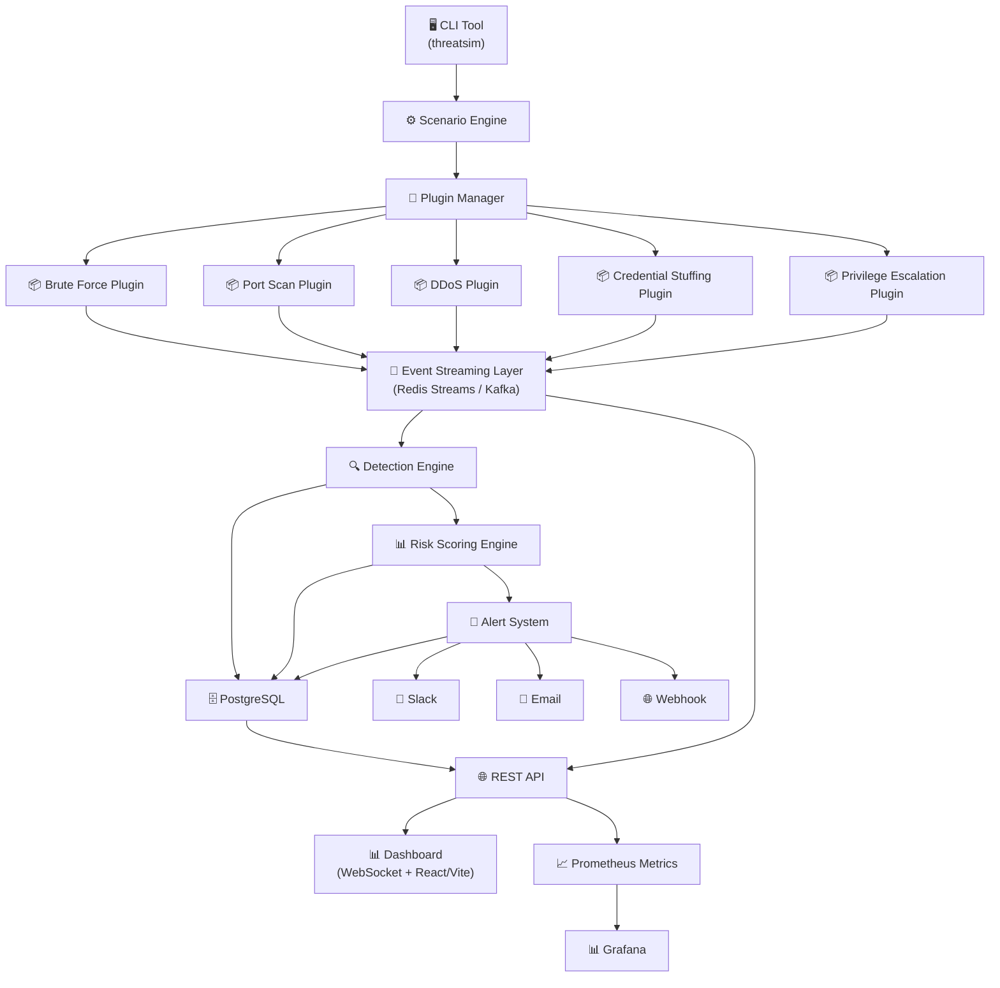

# ThreatSIM — Architecture & Implementation Plan

> **An open-source platform to simulate cyber attacks and test security detection systems.**

---

## 🏗️ High-Level Architecture



---

## 📂 Project Structure

```
ThreatSIM/
├── cmd/                          # CLI entry points
│   └── threatsim/
│       └── main.go
├── internal/
│   ├── core/                     # Core domain types & interfaces
│   │   ├── event.go              # Event types
│   │   ├── plugin.go             # Plugin interface
│   │   ├── rule.go               # Detection rule types
│   │   └── scenario.go           # Scenario types
│   ├── plugins/                  # Attack plugin implementations
│   │   ├── registry.go           # Plugin registry
│   │   ├── brute_force/
│   │   │   └── plugin.go
│   │   ├── port_scan/
│   │   │   └── plugin.go
│   │   ├── ddos/
│   │   │   └── plugin.go
│   │   ├── credential_stuffing/
│   │   │   └── plugin.go
│   │   └── privilege_escalation/
│   │       └── plugin.go
│   ├── scenario/                 # Scenario engine
│   │   ├── engine.go
│   │   └── loader.go            # YAML scenario loader
│   ├── streaming/                # Event streaming layer
│   │   ├── interface.go
│   │   ├── redis/
│   │   │   └── stream.go
│   │   └── kafka/
│   │       └── stream.go
│   ├── detection/                # Detection engine
│   │   ├── engine.go
│   │   ├── rule_loader.go
│   │   └── evaluator.go
│   ├── risk/                     # Risk scoring engine
│   │   ├── engine.go
│   │   └── scorer.go
│   ├── alerting/                 # Alert system
│   │   ├── manager.go
│   │   ├── slack.go
│   │   ├── email.go
│   │   └── webhook.go
│   ├── api/                      # REST API + WebSocket
│   │   ├── server.go
│   │   ├── handlers/
│   │   │   ├── attacks.go
│   │   │   ├── scenarios.go
│   │   │   ├── alerts.go
│   │   │   └── dashboard.go
│   │   ├── middleware/
│   │   │   └── cors.go
│   │   └── ws/
│   │       └── hub.go           # WebSocket hub for live updates
│   └── store/                    # Database layer
│       ├── postgres.go
│       └── migrations/
│           └── 001_initial.sql
├── configs/                      # Configuration files
│   ├── default.yaml              # Default config
│   ├── rules/                    # Detection rules
│   │   ├── brute_force.yaml
│   │   ├── port_scan.yaml
│   │   └── ddos.yaml
│   └── scenarios/                # Attack scenarios
│       ├── account_takeover.yaml
│       └── lateral_movement.yaml
├── dashboard/                    # Frontend (Vite + React)
│   ├── src/
│   │   ├── App.jsx
│   │   ├── components/
│   │   │   ├── AttackTimeline.jsx
│   │   │   ├── ThreatScore.jsx
│   │   │   ├── AlertFeed.jsx
│   │   │   ├── TopAttackers.jsx
│   │   │   └── LiveStatus.jsx
│   │   ├── hooks/
│   │   │   └── useWebSocket.js
│   │   └── pages/
│   │       ├── Dashboard.jsx
│   │       ├── Scenarios.jsx
│   │       └── Alerts.jsx
│   ├── index.html
│   ├── package.json
│   └── vite.config.js
├── deploy/                       # Deployment configs
│   ├── docker/
│   │   ├── Dockerfile
│   │   └── Dockerfile.dashboard
│   ├── docker-compose.yaml
│   └── k8s/
│       ├── deployment.yaml
│       └── service.yaml
├── scripts/                      # Helper scripts
│   └── setup.sh
├── go.mod
├── go.sum
├── Makefile
├── README.md
└── LICENSE
```

---

## 🔧 Technology Stack

| Layer | Technology | Rationale |
|-------|-----------|-----------|
| **Language** | Go | Fast, concurrent, great for CLI + backend services |
| **CLI Framework** | Cobra | Industry standard Go CLI framework |
| **Event Streaming** | Redis Streams (default) / Kafka (optional) | Redis is simpler for local dev; Kafka for production scale |
| **Detection Engine** | Custom (Go) | Lightweight, rule-based, YAML-configurable |
| **Database** | PostgreSQL | Reliable, supports JSON columns for flexible event storage |
| **REST API** | Gin / Chi | Lightweight HTTP framework for Go |
| **WebSocket** | gorilla/websocket | Real-time dashboard updates |
| **Dashboard** | Vite + React | Fast, modern frontend |
| **Metrics** | Prometheus client | Standard observability |
| **Containerization** | Docker + Docker Compose | Easy local deployment |
| **Config Format** | YAML | Human-readable rules, scenarios, and configs |

---

## 🧩 Component Deep-Dive

### 1. Core Domain Types

```go
// Event represents a security event generated by an attack plugin
type Event struct {
    ID        string            `json:"id"`
    Type      string            `json:"event_type"`
    Source    string            `json:"source_ip"`
    Target    string            `json:"target"`
    Service   string            `json:"service"`
    User      string            `json:"user,omitempty"`
    Metadata  map[string]any    `json:"metadata,omitempty"`
    Timestamp time.Time         `json:"timestamp"`
    PluginID  string            `json:"plugin_id"`
    Scenario  string            `json:"scenario,omitempty"`
}

// Plugin is the interface every attack plugin must implement
type Plugin interface {
    ID() string
    Name() string
    Description() string
    DefaultConfig() map[string]any
    Execute(ctx context.Context, config map[string]any, sink EventSink) error
}

// EventSink receives generated events
type EventSink func(event Event) error
```

### 2. Plugin System

Each plugin is a self-contained Go package implementing the `Plugin` interface. Plugins are registered at startup via a registry pattern (no dynamic loading needed for v1).

**Brute Force Plugin** generates `login_failed` events in rapid succession from configurable IPs.

**Port Scan Plugin** generates `port_probe` events across a range of ports.

**DDoS Plugin** generates `http_request` events at extremely high frequency.

### 3. Attack Scenario Engine

Scenarios are defined in YAML and loaded at runtime:

```yaml
scenario:
  name: account_takeover
  description: "Simulates a full account takeover attack chain"
  steps:
    - plugin: port_scan
      config:
        target: "10.0.0.1"
        ports: "1-1024"
      delay: 5s
    - plugin: credential_stuffing
      config:
        target_service: auth-service
        userlist: ["admin", "root", "user1"]
      delay: 2s
    - plugin: privilege_escalation
      config:
        target_user: admin
```

The engine executes steps sequentially with configurable delays between them.

### 4. Event Streaming Layer

Abstracted behind an interface so we can swap Redis Streams (lightweight, default) and Kafka (production):

```go
type EventStream interface {
    Publish(ctx context.Context, topic string, event Event) error
    Subscribe(ctx context.Context, topic string, handler func(Event)) error
    Close() error
}
```

### 5. Detection Engine

Loads rules from YAML files and evaluates incoming events using sliding window counters:

```yaml
rules:
  - name: brute_force_attack
    description: "Detects brute force login attempts"
    condition:
      event_type: login_failed
      group_by: source_ip
      threshold: 20
      window: 30s
    severity: high
    
  - name: port_scan_detected
    description: "Detects port scanning activity"
    condition:
      event_type: port_probe
      group_by: source_ip
      threshold: 50
      window: 60s
    severity: medium
```

### 6. Risk Scoring Engine

Calculates cumulative risk per source IP / attack session:

| Attack Type | Base Score |
|------------|-----------|
| Port Scan | 30 |
| Brute Force | 60 |
| Credential Stuffing | 70 |
| DDoS | 90 |
| Privilege Escalation | 85 |

**Threat Levels:**
- 0-30: LOW
- 31-60: MEDIUM  
- 61-80: HIGH
- 81-100: CRITICAL

### 7. Alert System

Dispatches alerts when risk thresholds are crossed:

```go
type AlertChannel interface {
    Send(ctx context.Context, alert Alert) error
}
```

Implementations: Slack (webhook), Email (SMTP), Webhook (HTTP POST), Dashboard (WebSocket push).

### 8. Dashboard

Real-time dashboard showing:
- **Active Attacks** — live feed of running simulations
- **Threat Score Gauge** — current system threat level
- **Attack Timeline** — chronological event visualization
- **Top Attacker IPs** — leaderboard of most active source IPs
- **Detection Alerts** — real-time alert stream

---

## 🚀 Implementation Phases

### Phase 1: Foundation (Core + CLI + 2 Plugins)
1. Initialize Go module, project structure
2. Define core domain types (`Event`, `Plugin`, `Scenario`)
3. Implement plugin registry
4. Build **brute_force** and **port_scan** plugins
5. Create CLI with `threatsim start`, `threatsim simulate <plugin>`
6. Implement Redis Streams event layer
7. Basic console output for events

### Phase 2: Detection + Risk Engine
1. Implement detection engine with YAML rule loading
2. Build sliding window evaluator
3. Implement risk scoring engine
4. Create detection rules for brute force & port scan
5. Wire detection engine to event stream consumer

### Phase 3: Scenario Engine + More Plugins
1. Build scenario engine with YAML loader
2. Implement `threatsim run scenario <name>`
3. Add **credential_stuffing**, **ddos**, **privilege_escalation** plugins
4. Create sample scenarios (account_takeover, lateral_movement)

### Phase 4: Alert System + API
1. Implement alert manager with channel interface
2. Build Slack, Email, Webhook alert channels
3. Create REST API for dashboard data
4. WebSocket endpoint for live updates
5. PostgreSQL storage for events, alerts, metrics

### Phase 5: Dashboard
1. Initialize Vite + React project
2. Build dashboard components (timeline, threat gauge, alert feed)
3. Implement WebSocket connection for live data
4. Responsive, dark-mode design

### Phase 6: Observability + Deployment
1. Add Prometheus metrics endpoint
2. Grafana dashboard templates
3. Docker + Docker Compose setup
4. Documentation and README

---

## 🎯 Key Design Decisions

### Why Go?
- **Concurrency**: Go's goroutines are perfect for simulating concurrent attacks
- **Performance**: Compiled binary, fast startup, low memory
- **CLI ecosystem**: Cobra is the gold standard for CLI tools
- **Single binary**: Easy distribution, no runtime dependencies
- **Standard in security tooling**: Many security tools are written in Go

### Why Redis Streams over Kafka (as default)?
- **Simpler setup**: Single dependency vs. Kafka + ZooKeeper
- **Good enough for local dev**: Handles thousands of events/sec
- **Abstracted**: Can swap to Kafka for production via config
- **Lower resource usage**: Important for `docker compose up` experience

### Why YAML for Rules/Scenarios?
- **Human-readable**: Security teams can write rules without code
- **Git-friendly**: Easy to version control
- **Extensible**: Can add new fields without code changes
- **Industry standard**: Similar to Sigma rules, Kubernetes configs

---

## 💬 Discussion Points

Before we start building, let's align on a few things:

1. **Language**: I've proposed **Go** — are you comfortable with Go, or would you prefer **Python** or **TypeScript/Node.js**?

2. **Phase 1 scope**: Should we start with Phase 1 (core + CLI + 2 plugins + Redis Streams) and iterate?

3. **Event streaming**: Start with **Redis Streams** (simpler) and add Kafka support later?

4. **Dashboard**: **Vite + React** for the frontend? Or would you prefer a simpler approach (plain HTML + WebSocket)?

5. **Database**: **PostgreSQL** for persistent storage? Or start with in-memory and add persistence later?

6. **Testing priority**: Should we include tests from day one, or build the MVP first and add tests in a later phase?

Let me know your preferences and we can start building! 🚀
